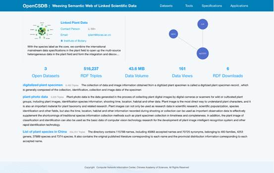

# OpenCSDB

This software providing 3 funtions: 1) data identification. it assigns persistent unique IDs to datasets and allowing metadata, storage location, and service entrance retrieval upon ID query; 2) semantic publishing. it standardizes attributes of dataset/records using controlled vocabulary, connect thems into data views, publishes data views in RDF format and further establishes coreferences between geo-distributed views. 3) semantic querying. it retrieves information from data views for users via SPARQL.

## I. Portal Home Page

1. Portal address:http://semweb.csdb.cn/

2. Enter the above address in the browser to enter the portal home page. According to the layout from top to bottom, the home page displays the following contents: title, navigation bar, search box, platform statistical information, knowledge atlas of disciplinary datasets and dataset list. See below. 

3. Platform statistics are statistics for Open Datasets, RDF Triples, Data Volume, Data Views, RDF Downloads.

4. The data set list displays the title, RDF data volume and basic introduction. The subject area or publishing organization can be filtered and displayed through the check box on the left.

5. The knowledge graph of disciplinary dataset shows the association relationship of all datasets in the site. The node size represents the volume of the dataset, and the distance between nodes represents the close association between the two datasets.

6. Click the four different tabs in the navigation bar, and the responses are as follows: Datasets navigate to the dataset list page, Tools, Specifications, Applications enter the tool set page, specification page, application demonstration page respectively. 

7. Enter the search term and click "Search" to enter the data resource search page, displaying the data search list. See for details. 

8. Click any title on the dataset list page at the bottom of the home page to enter the dataset details page. If you click on the first data set, you will go to the following page.

9. The dataset details page displays the following information from top to bottom: dataset title, dataset introduction, keywords, contacts and contact information, SPARQL Endpoints, metadata download link, data download link, etc. Among them, metadata download link provides the followingfour ways: JSON-LD, RDF/XML, Turtle, N-Triples; data download link provides RDF download way.

10. In the details page of the dataset, enter the search term and click "Search" to enter the data resource search page and display the data search list. See for details. 

11. The data details page provides the number of associations between this dataset and other datasets. For example, this dataset has 1937240, 3874479 and 387448 associations with international open data sources bioportal-cheminf, bioportal-sio and bioportal-chebi in LOD, respectively. 

12. At the bottom of the details page, the association map of this dataset is displayed. By clicking, you can enter the details page of this dataset separately.

## II. Data Resource Search

1. On the homepage of the portal, enter the search term in the search box, click "Search" to enter the data resource search page and display the data search list.

2. If the search term is "water", the following data entity list can be retrieved, and all the entity contents related to "water" such as compounds, microorganisms and plants can be obtained across three different subject fields. as shown. 

3. The data list displays the following attributes of the retrieved data resource entity: label name, RDF:type, associated resource, organization domain, and data set.

4. Click URI to jump to URI resolution display page of external data source, such as CHEMBI: 24431, etc.

5. Click institution to enter the specific parsing place of institution vocabulary, such ashttp://semweb.casdc.cn/resource/casorgs#IM

6. Click on the dataset to enter the dataset details page.

7. Click the title of any search result to enter the entity resource details page. For example, click on the first search result to get the following page, as shown in. 

8. The resource details page displays the RDF detailed analysis of data resources and the association relationship graph respectively.

9. As shown in the figure above, RDF triples are displayed for the content details of resources in the three datasets, and secondary parsing is performed for some attributes.

10. On the right is information about the organization to which the data entity belongs.

## III. Tool Set

1. Click "Tools" on the navigation bar of the platform to enter the toolsets page of the Scientific Data Association Web Portal.

2. This page shows two common support service tools of scientific data association network system, namely scientific data ontology publishing tool and scientific data thesaurus publishing tool.

3. This page displays the toolset logo, title, and profile information, respectively.

4. Click the tool title on the tool set list page, jump to the corresponding link and enter the system home page of 2 tools respectively. The jump links arehttp://ols.semweb.csdb.cn/ and www.example.com.http://skos.semweb.csdb.cn/

5. The English names and brief descriptions of the two tools of the scientific data association network system displayed on this page are as follows:

*Semantic Ontology Publishing System*

*The ontology aims to solve the problem of semantic inconsistency of multi-source data. It provides ontology publishing, searching, browsing and downloading services.*

 

*Semantic Vocabulary Publishing System*

*Simple Knowledge Organization System (SKOS) is a W3C recommendation designed for representation of thesauri, classification schemes, taxonomies, subject-heading systems, or any other type of structured controlled vocabulary. The Skos aims to achieve synonym normalization. It provide seasy publication and use of such vocabularies as linked data.*

 

## IV. Vocabulary specification

1. Click "Specifications" on the navigation bar of the platform to enter the vocabulary specification page of the scientific data association network portal platform.
2. This page shows four common supporting vocabulary specifications of scientific data association network system. Their Chinese and English names and brief descriptions are as follows:

​	**Chinese Academy of Sciences**

The Chinese Academy of Sciences (CAS), founded in November 1949, is the highest academic institution of natural sciences in China, the highest advisory body of science and technology, and the comprehensive research and development center of natural sciences and high technology. There are 12 branches and 114 research institutes of CAS. This glossary mainly describes the standard Chinese names and English names of various institutes and organs under CAS, and describes the hierarchical relationship among institutions through superordinate words and hyponyms.

​	**Lexicon of Academies and Institutions of CAS**

The Chinese Academy of Sciences (CAS) was established in November 1949 as the highest academic institution of natural science, the highest consulting institution of science and technology, and the integrated research and development center of natural science and high technology in China. The CAS has 12 departments and 114 research institutes. This lexicon mainly describes the standard Chinese names and English names of the institutes and organizations under the CAS, and describes the hierarchical relationship between the institutes through the hypernym and hyponym.

​	**Classification of disciplines**

Discipline classification and code standard (GB/T 13745-2009) is the current national discipline classification standard, which defines discipline classification into Grade I, Grade II and Grade III, with 62 Grade I disciplines or discipline groups, 676 Grade II disciplines or discipline groups and 2382 Grade III disciplines. According to the national standard, the subject classification vocabulary of this subject is described in a standardized way, which provides a semantic unified vocabulary standard for the subject allocation of current scientific data resources, and describes the hierarchical relationship among subject classifications through superordinate words and subordinate words.

The classification and code standard of disciplines (GB/T 13745-2009) is the current national classification standard of disciplines, which defines the classification of disciplines to the first, second and third levels, with 62 primary disciplines or discipline groups, 676 secondary disciplines or discipline groups and 2382 third-level disciplines. This discipline classification lexicon, based on the national standard, standardizes the description of discipline classification subject terms, provides a semantically unified lexicon specification for the configuration of disciplines to which the current scientific data resources belong, and describes the hierarchical relationship between discipline classifications through the hypernym and hyponym.

 	**Dataset Core Metadata Vocabulary**

Dataset metadata is data that describes a specific data resource object, can locate and manage this object, and is helpful for its discovery and acquisition. This thesaurus mainly refers to Dublin Core, Scientific Data Core Metadata special standard, core metadata description of each field, extracts key metadata fields, unifies and standardizes metadata subject words, provides a thesaurus specification of metadata information for current scientific data resource specification description, and describes hierarchical relations among subject words through superordinate words and hypoonyms.

​	**Dataset core metadata Lexicon**

Dataset metadata is the data that describes a specific data resource object and enables the identification and management of this object, and helps its exploration and acquisition. This lexicon refers to Dublin Core, the special standard "Scientific Data Core Metadata", and the description of core metadata in various domains, and provides a lexicon specification of metadata information for the current scientific data resource specification description by extracting key metadata fields and unifying standardized metadata subject words, and describing the hierarchical relationship between subject words through the hypernym and hyponym.

​	**Model core metadata**

Model metadata is data that describes a specific algorithm model, and can position and manage this algorithm model, and contribute to its discovery and acquisition. This thesaurus mainly refers to the metadata description information specifications of algorithm models in several national discipline data centers, extracts key metadata fields, unifies and standardizes subject words, provides the thesaurus specification of metadata information for the specification description of algorithm models in current scientific research, and describes the hierarchical relationship among subject words of algorithm models through superordinate words.

Model metadata is the data that describes a specific algorithm model, and can identify and manage this algorithm model, and helps its exploration and acquisition. This lexicon mainly refers to the algorithm model metadata description information specification of several national scientific data centers, and provides a lexicon specification of metadata information for the description of algorithm model specification in current scientific research by extracting key metadata fields and unifying standardized subject words, and describes the hierarchical relationship between algorithm model subject words through the hypernym and hyponym.

## *V. Application demonstration*

1. Click "Applications" on the navigation bar of the platform to enter the application demonstration page of the scientific data association network portal platform.

2. This page shows three application demonstrations of the scientific data association network portal platform at present. The English names and descriptions are as follows:

​	**Linked Plant Data**

With the species label as the core, we combine the international mainstream data specifications in the plant field to open up the multi-source heterogeneous data in the plant field and form the integration and discovery service for the deep integration of the plant data, provide corresponding knowledge discovery services for specific problems and research.

​	**Linked Micro Data**

Establish a common ontology in microbiology covering nine types of core data, including trait function data, histology data, enzyme data, metabolic network, literature, and patent data, and realize the semantic correlation of distributed multi-center microbiology data for publication.

​	**Linked Chemdb Data**

Linked Chemdb Data is an important part of the comprehensive chemical science and technology information database. It supports chemical data remittance and promotes data accumulation, sharing and mining.

3. The application demonstration page displays the title, profile, Logo, profile, and demonstration organization of each application demonstration.

4. Click on the title of each demonstration to go to the specific portal page for that demonstration.

5. For example, click "Linked Plant Data" to enter the details page. 

6. In the application demonstration list page, click "Linked Plant Data" to enter the plant association data portal page.

7. On the plant application demonstration page, the following information is displayed from top to bottom: demonstration name, contact person and Email, organization, introduction, demonstration data set association map, demonstration data statistics, and specific data set list included in the demonstration.

8. The application demonstration portal platform statistics are Open Datasets, RDF Triples, Data Volume, Data Views, and RDF Downloads statistics.

9. The data set list displays the title, RDF data volume and basic introduction. The subject area or publishing organization can be filtered and displayed through the check box on the left.

10. The knowledge graph of disciplinary dataset shows the association relationship of all datasets in the site. The node size represents the volume of the dataset, and the distance between nodes represents the close association between the two datasets. For example, the size and distance between three data sets published in the field of plant science represent the amount of data and the number of associations.

11. Click any title on the dataset list page at the bottom of the home page to enter the dataset details page. If you click on a data set, you will enter the page as shown in Figure 2.
